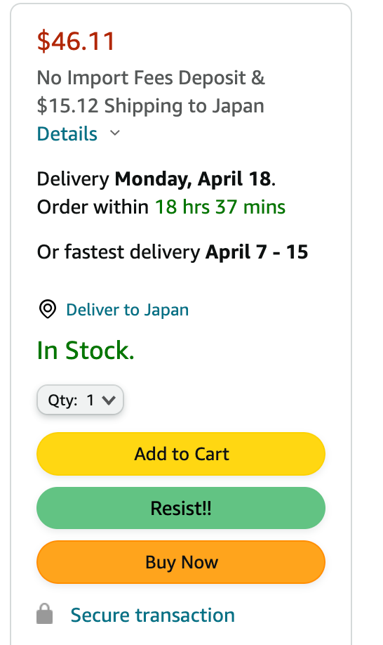
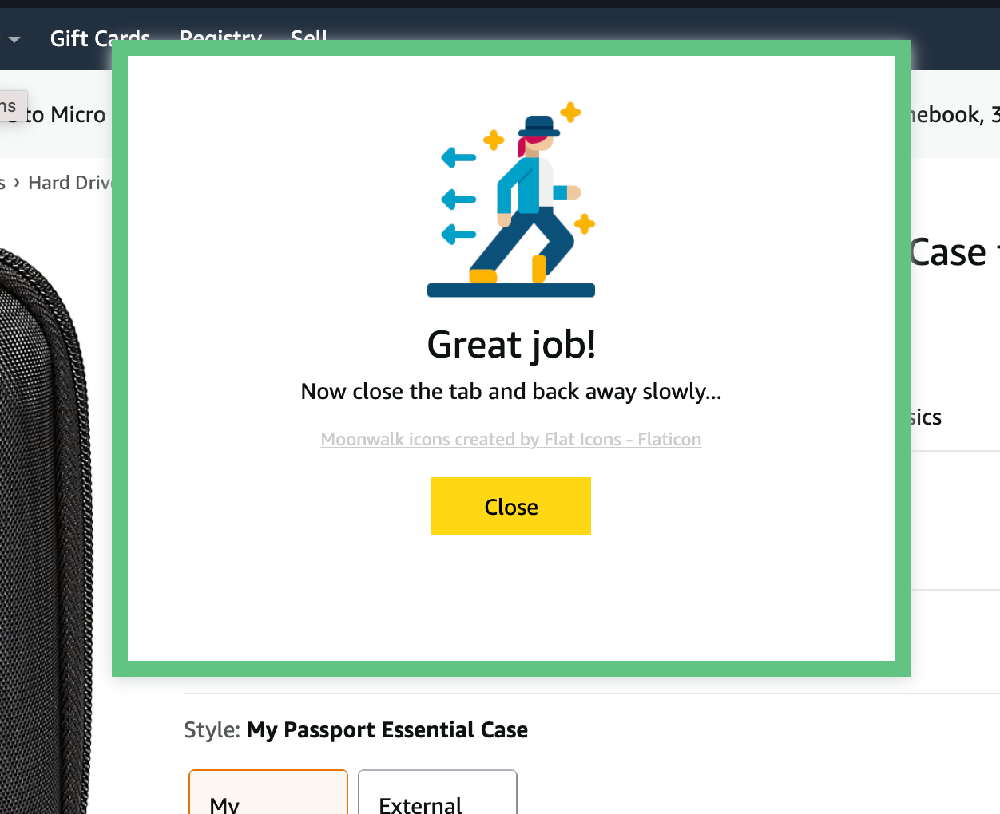

# ReadMe

## Objectives
E-commerce companies spend loads of money into research, technology, and design in order to encourage people to make purchases.
This consumerism is not necessarily in the interest of the buyer. But gradually as users on computers or smartphones we are becoming trained to buy.

An online store is designed with an array of choices - what to buy?

This extension is an attempt to give people a clear choice to "not buy".

The idea is that by displaying a "Resist!!" button alongside the "Buy" button
and providing positive feedback upon clicking this button, we can give the choice of not making a purchase on a website
equal weightage to the choice of making a purchase.

Hopefully, by making the choice visible and positive as opposed to invisible and negative (no button, and no positive feedback)
We can reduce the burden on sheer human willpower.

This is what the popup looks like. Image and text message are somewhat randomized to optimize the dopamine kick.

## Currently handled sites
- amazon.com
- amazon.co.jp

## Todos (Roadmap)

- Put together a list of sites to handle and begin making resist buttons that fit in with the site's design.
  - Sites to support **(help wanted!)**
    - Other amazons (amazon.in, amazon.uk etc)
    - ebay.com
    - rakuten.co.jp
    - apple.com
    - samsung.com
    - walmart.com
    - etsy.com
    - ikea.com
    - homedepot.com
- Improve positive feedback mechanism
  - Consider adding CTA to close the tab: what should the design look like?
  - Consider adding opacity div to the background of the popup to improve contrast (and enable click to dismiss)
  - Might have underestimated the amount of css required. If it gets a lot consider moving to sass.
  - Amazon does not use media queries to render responsive design. Can we get device type and switch the styling that way..?
  - Increase variety of messages to 20 per language (target)
- Settings page
  - Domain blacklist (do not function on these domains)
- Flexible buy button detection (hard).
  - Detect buy buttons on unsupported websites and inject resist!! button (requires turn-off switch because of potential design breaks.)

## Privacy

No user data is currently collected (and certainly nothing is sold).

If this takes off and users want it, it might be helpful to track the number of times a user presses
the resist button and how much was totally not-spent as a result.
If this is done it would still be purely for the user's own benefit and not shared / sold.

## Help wanted
Mobile app users are probably far more prevalent than chrome users. Any ideas on how similar functionality can be implemented for apps?
